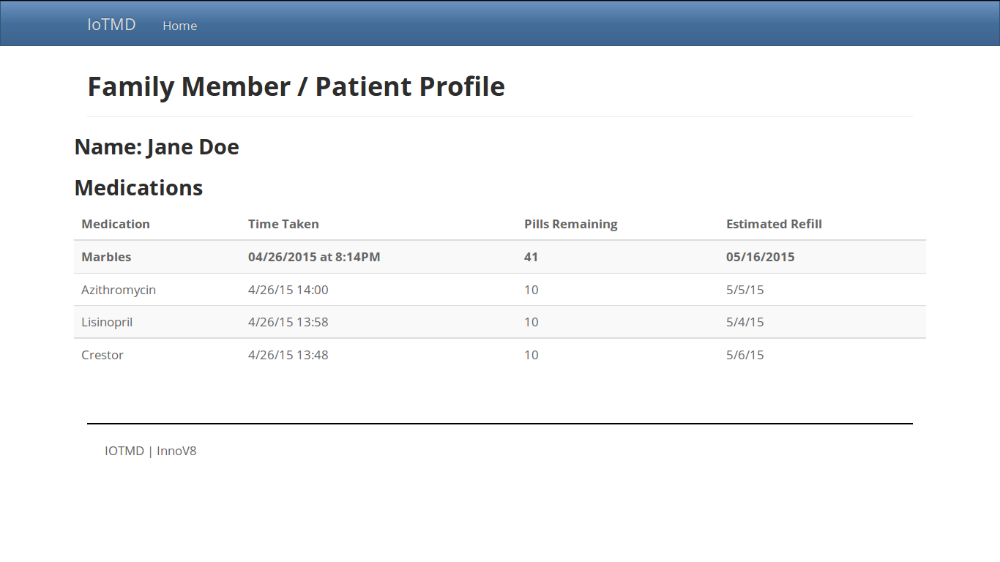

#IoTMD
##Cisco WISE/IEEE Internet of Things Hackathon
###April 26, 2015. San Jose, California.

IoTMD is an Internet of Things prototype developed and built at a one-day Cisco WISE/IEEE Hackathon: [cisco-ieee.com](http://cisco-ieee.com)

##Concept

We set out to make protoype a medical/IoT product that would allow family members, doctors, and pharmacies to track the prescription pill consumption of a loved one or patient.

Our protoype uses sensors and a prescription pill bottle to determine:

1. How many pills are in the bottle
2. When the pill bottle was last opened

These readings are fed to a web interface, which would allow users to view this valuable information in real time. 

##Hardware

We used two sensors, both from Phidgets: [phidgets.com](http://www.phidgets.com):

1. Button-style pressure sensor mounted under the makeshift "pill bottle" to determine the bottle's weight.
2. Circular pressure sensor within the pill bottle cap to determine when the bottle was last opened.

These were connected to a small POE adapter provided by Cisco.

##Software

We used a python script to interface with the sensors, and an Angular.js application with the Gulp.js webserver to build the web interface.

Our web interface:

All code is found in this repository and can be freely used.

##Team

- Jawahar Santosh, San Jose State University
- Barbara Porter, CTO, FragranceNet.com
- Shriv Prattipati, Wipro Limited
- Nat Baklitskaya, Qualcomm Atheros, Inc.
- Alex Klibisz, Computer Science Undergraduate, University of Tennessee

